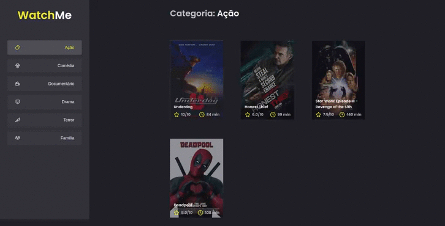

# **WatchMe**

 * Projeto desenvolvido pela rockseat. A ideia é desenvolver um site de filmes listando as categories, usando o layout do figma juntamento com o SCSS para seu desenvolvimento.

 

# 🖥 Tecnologias utilizadas no projeto

 ✅ SCSS - Folha de estilo

 ✅ React-Icons - Pacote de Icones
  * Icones da aplicação

 

# 🧑‍💻 Densenvolvimento das telas

✔ Pagina Inicial com os filmes e generos

 

# Instalação

~~~html
# Copie e cole no seu terminal 

$ git clone https://github.com/OttoSouza/ignite_movies_chapter_I.gitgit
~~~

~~~html
# Acesse a pasta
$ cd ignite_movies_chapter_I

# Instale as dependencias 
$ yarn install

# Execute
$ yarn start

# Acessa pelo  browser 
$ https://localhost:8080
~~~

 

#

